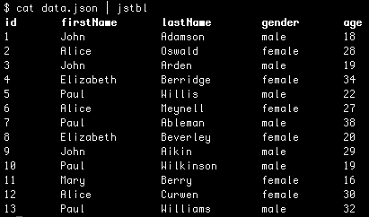
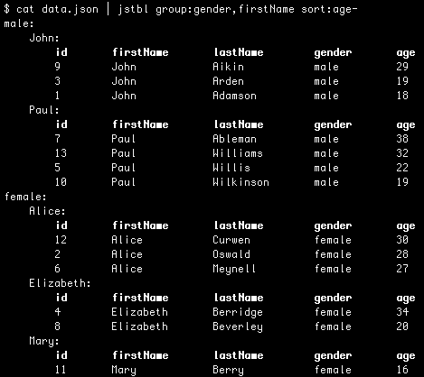

# jstbl

Tool to print JSON data in a table manner

## Example

Suppose we have following JSON file

```js
[
    {"id":1,"firstName":"John","lastName":"Adamson","gender":"male","age":18},
    {"id":2,"firstName":"Alice","lastName":"Oswald","gender":"female","age":18},
    {"id":3,"firstName":"John","lastName":"Arden","gender":"male","age":18},
    {"id":2,"firstName":"Elizabeth","lastName":"Berridge","gender":"female","age":18},
    {"id":3,"firstName":"Paul","lastName":"Willis","gender":"male","age":18},
    {"id":2,"firstName":"Alice","lastName":"Meynell","gender":"female","age":18},
    {"id":3,"firstName":"Paul","lastName":"Ableman","gender":"male","age":18},
    {"id":2,"firstName":"Elizabeth","lastName":"Beverley","gender":"female","age":18},
    {"id":3,"firstName":"John","lastName":"Aikin","gender":"male","age":18},
    {"id":3,"firstName":"Paul","lastName":"Wilkinson","gender":"male","age":18},
    {"id":2,"firstName":"Mary","lastName":"Berry","gender":"female","age":18},
    {"id":2,"firstName":"Alice","lastName":"Curwen","gender":"female","age":18},
    {"id":3,"firstName":"Paul","lastName":"Williams","gender":"male","age":18}
]
```

We can print it as a table using `jstbl`:



Also, it is possible to apply some processing commands before printing:  


